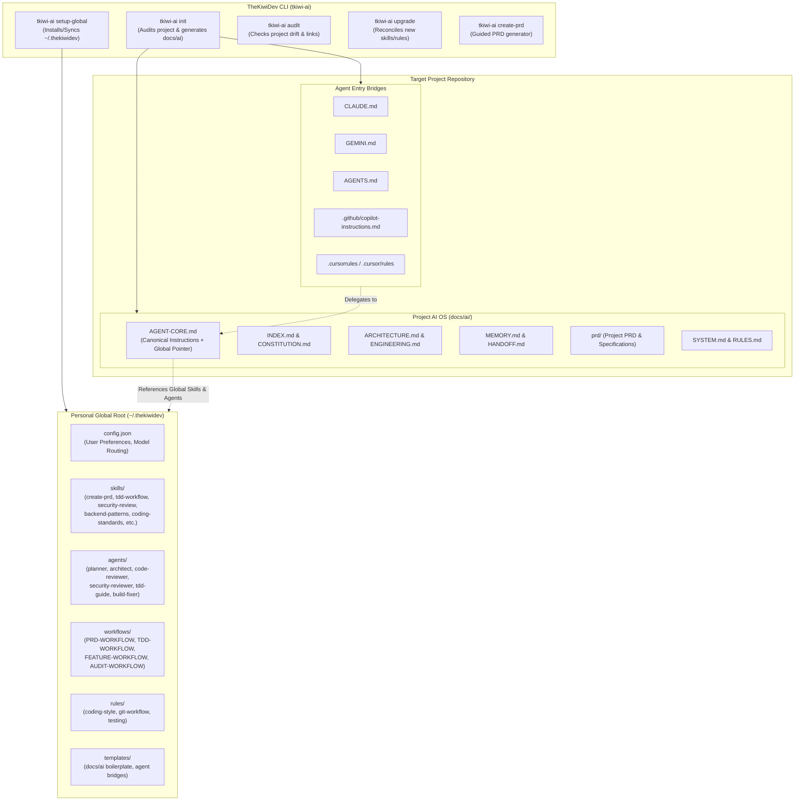

# Universal AI Agent System (TheKiwiDev AI System)

An agent-agnostic, dual-tier AI operating system that decouples **personal global capabilities** (skills, workflows, agents, core rules) from **project-specific reality** (architecture, engineering conventions, PRDs, memory, handoffs). Compatible with Claude Code, Google Antigravity / Gemini CLI, GitHub Copilot, OpenAI Codex / ChatGPT, Cursor, Windsurf, MetaMuse, and general AI coding agents.

---

## 1. System Architecture

---

## 2. Key Components & Specifications

### 2.1 The Global Root (`~/.thekiwidev`)
The global folder acts as the single source of truth for your personal AI toolchain:
- **`~/.thekiwidev/config.json`**: Base configuration, preferred agents, paths, fallback policies.
- **`~/.thekiwidev/skills/`**:
  - **`create-prd/`**: Interactive, rigorous PRD creation skill (Problem statement, Target user personas, User journeys, Functional requirements, Non-functional specs, Acceptance criteria, Technical constraints, Architecture alignment).
  - **Existing and extended skills**: `tdd-workflow`, `backend-patterns`, `frontend-patterns`, `coding-standards`, `security-review`, `verification-loop`, `eval-harness`, `continuous-learning`, `strategic-compact`.
- **`~/.thekiwidev/agents/`**:
  - `planner.md`, `architect.md`, `code-reviewer.md`, `security-reviewer.md`, `tdd-guide.md`, `build-error-resolver.md`, `refactor-cleaner.md`, `doc-updater.md`, `e2e-runner.md`.
- **`~/.thekiwidev/workflows/`**:
  - `PRD-WORKFLOW.md`, `FEATURE-WORKFLOW.md`, `TDD-WORKFLOW.md`, `CODE-REVIEW-WORKFLOW.md`, `AUDIT-WORKFLOW.md`.
- **`~/.thekiwidev/rules/`**:
  - Global base engineering, Git safety (never commit/branch autonomously), testing expectations.

### 2.2 Project-Specific AI Operating System (`docs/ai/` + Bridges)
Every project initialized with the system receives:
- **Universal Entry Points**:
  - `AGENTS.md` (standard cross-agent instruction file for OpenAI Codex, ChatGPT, MetaMuse, etc.)
  - `CLAUDE.md` (Claude Code)
  - `GEMINI.md` (Google Antigravity & Gemini CLI)
  - `.github/copilot-instructions.md` (GitHub Copilot)
  - `.cursorrules` / `.cursor/rules/` (Cursor)
- **Canonical Instruction Core**: `docs/ai/AGENT-CORE.md`
  - Defines the 8-step lifecycle: `Orient → Understand → Plan → Reuse Search → Implement → Verify → Record → Handoff`.
  - Enforces Git boundary rules (no autonomous commits, branches, or push).
  - **Global Skill & Agent Resolution Protocol**:
    Instructs any AI agent:
    > "When asked to invoke a skill (e.g. `create-prd`, `tdd-workflow`) or agent (e.g. `architect`, `planner`), resolve it first from `~/.thekiwidev/skills/<name>/SKILL.md` or `~/.thekiwidev/agents/<name>.md`. If running in an environment without `~/.thekiwidev/` (e.g., CI or teammate machine), fall back to local `docs/ai/` definitions."
- **Project Reality Documentation**:
  - `docs/ai/prd/` (PRD and specs)
  - `docs/ai/ARCHITECTURE.md` (Stack, component map, data flow)
  - `docs/ai/ENGINEERING.md` (Commands, conventions, local package manager)
  - `docs/ai/MEMORY.md` (Current state of truth)
  - `docs/ai/HANDOFF.md` (Active work in progress)
  - `docs/ai/SYSTEM.md` (Manifest and configuration)

### 2.3 The CLI Management Tool (`tkiwi-ai` / `bin/tkiwi-ai`)
A zero-dependency Node.js CLI script (runs instantly on macOS, Linux, and Windows with just `node`):
- **`tkiwi-ai setup-global`**: Populates or updates `~/.thekiwidev/` from this source repository.
- **`tkiwi-ai init [dir]`**:
  - Detects project mode using the 6-mode decision tree (`INIT`, `ADOPT`, `UPGRADE`, `AMEND`, `AUDIT`, `EXTEND`).
  - Audits codebase (detects language, frameworks, package manager, git config).
  - Prompts the user for missing details (project name, core purpose, PRD status).
  - Generates `docs/ai/` and bridges linked to `~/.thekiwidev`.
- **`tkiwi-ai create-prd`**:
  - Launches an interactive questionnaire in the terminal or outputs an agent prompt to generate a complete PRD into `docs/ai/prd/PRD.md`.
- **`tkiwi-ai audit [dir]`**:
  - Checks for drift, missing files, broken links to `~/.thekiwidev`, or unregistered rules.
- **`tkiwi-ai upgrade [dir]`**:
  - Safely reconciles project docs with new global capabilities without overwriting project-specific knowledge.
- **`tkiwi-ai export [dir]`**:
  - Copies global skills/workflows into the project for standalone distribution (e.g., for open-source repos or teams without global setups).

### 2.4 Prompt-Driven Initializer (`universal-agent-system-initializer.md`)
An updated V3 specification combining `ai-project-agent-system-initializer-v2.md` with the global `~/.thekiwidev` architecture. If the user is inside an AI chat without the terminal CLI, they can simply feed this document to any AI agent, and the agent will execute the exact same setup and audit.

---

## 3. User Review Required

> [!IMPORTANT]
> **Global Folder Location**: By default, the system will use `~/.thekiwidev` (with a symlink or fallback to `~/.theqdev`). We also support configuring a custom location via environment variable `THEKIWIDEV_AI_HOME`.

> [!IMPORTANT]
> **Zero-Dependency CLI**: The CLI is built in pure Node.js (compatible with Node 18+) so it requires no `npm install` to run anywhere. It can be symlinked to `/usr/local/bin/tkiwi-ai` or `~/.local/bin/tkiwi-ai` for instant global terminal access.

---

## 4. Proposed Changes

### Global Core & Library
#### [NEW] [create-prd skill](file:///Users/thekiwidev/work/me/ai-system/skills/create-prd/SKILL.md)
- Complete PRD generation skill including templates, questioning framework, validation criteria, and schema.

#### [NEW] [global workflow definitions](file:///Users/thekiwidev/work/me/ai-system/workflows/)
- `workflows/PRD-WORKFLOW.md`
- `workflows/FEATURE-WORKFLOW.md`
- `workflows/TDD-WORKFLOW.md`
- `workflows/CODE-REVIEW-WORKFLOW.md`
- `workflows/AUDIT-WORKFLOW.md`

#### [NEW] [universal agent templates](file:///Users/thekiwidev/work/me/ai-system/templates/)
- Standardized templates for `AGENT-CORE.md`, `INDEX.md`, `CONSTITUTION.md`, `WORKFLOW.md`, `ARCHITECTURE.md`, `ENGINEERING.md`, `VERIFICATION.md`, `HANDOFF.md`, `MEMORY.md`, `SYSTEM.md`.
- Universal bridges for `CLAUDE.md`, `GEMINI.md`, `AGENTS.md`, `.github/copilot-instructions.md`, `.cursorrules`.

---

### Universal CLI Tool
#### [NEW] [CLI executable entry](file:///Users/thekiwidev/work/me/ai-system/bin/tkiwi-ai)
- Executable binary with `#!/usr/bin/env node`.

#### [NEW] [CLI engine and modules](file:///Users/thekiwidev/work/me/ai-system/scripts/cli/)
- `scripts/cli/index.js` — Main CLI router and commander.
- `scripts/cli/detector.js` — Codebase analyzer (stack, language, package manager, existing AI files, git).
- `scripts/cli/modes.js` — 6-mode decision engine (INIT, ADOPT, UPGRADE, AMEND, AUDIT, EXTEND).
- `scripts/cli/global-manager.js` — Installs, syncs, and manages `~/.thekiwidev/`.
- `scripts/cli/project-builder.js` — Generates `docs/ai/` and agent bridge files.
- `scripts/cli/prd-generator.js` — Interactive PRD questionnaire and file generator.
- `scripts/cli/auditor.js` — Validates system consistency and reports drift.

---

### Master Initializer Specification (V3)
#### [NEW] [ai-project-agent-system-initializer-v3.md](file:///Users/thekiwidev/work/me/ai-system/ai-project-agent-system-initializer-v3.md)
- Complete unified instruction incorporating the global `~/.thekiwidev` hierarchy, universal multi-agent bridges, and cross-agent resolution rules into the v2 6-mode engine.

---

## 5. Verification Plan

### Automated Tests
1. Run CLI self-test:
   - `node bin/tkiwi-ai --help`
   - Test global setup in dry-run mode or target directory:
     `THEKIWIDEV_AI_HOME=/tmp/test-thekiwidev node bin/tkiwi-ai setup-global`
   - Verify all skills, agents, workflows, and templates are copied correctly to the target global folder.
2. Test project initialization on a fixture repository:
   - Create a test fixture in `/tmp/test-project` (representing a brownfield project).
   - Run `node bin/tkiwi-ai init /tmp/test-project` in non-interactive / automated mode.
   - Verify created files: `docs/ai/AGENT-CORE.md`, `AGENTS.md`, `CLAUDE.md`, `GEMINI.md`, `.github/copilot-instructions.md`, `.cursorrules`.
   - Run `node bin/tkiwi-ai audit /tmp/test-project` to verify 100% clean audit pass.

### Manual Verification
1. Verify `create-prd` workflow produces a structured PRD document conforming to the schema.
2. Confirm the agent entry files accurately instruct Claude Code, Google Antigravity/Gemini CLI, and Copilot to locate global skills in `~/.thekiwidev/skills/`.
